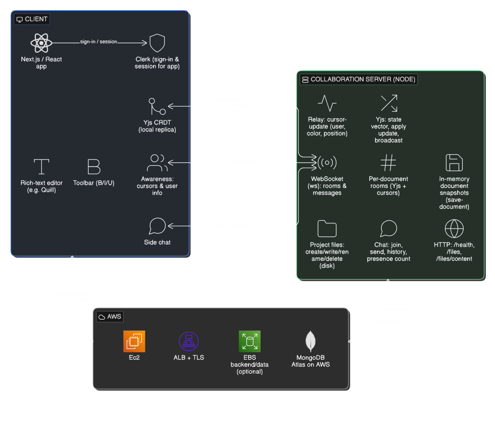

# CollabWriter - Single Platform for Document & Code Editor

CollabWriter is a full-stack collaborative workspace that combines a rich-text document editor and a code playground in one application. Users get live cursors, in-editor chat, a simulated terminal, file-tree sync, and document persistence backed by MongoDB, with authentication handled by Clerk.

**Live demo:** [https://collabwriter.serviceapp.live/](https://collabwriter.serviceapp.live/)

---

## Table of contents

1. [Features](#features)
2. [Architecture overview](#architecture-overview)
3. [Tech stack](#tech-stack)
4. [Repository structure](#repository-structure)
5. [Prerequisites](#prerequisites)
6. [Setup instructions](#setup-instructions)
7. [Environment variables](#environment-variables)
8. [Running locally](#running-locally)
9. [Production deployment (summary)](#production-deployment-summary)
10. [AI tools used](#ai-tools-used)
11. [Known limitations](#known-limitations)

---

## Features

- **Authentication:** Sign-in and session management via [Clerk](https://clerk.com/).
- **Rich-text documents:** Quill-based editor with formatting toolbar and collaborative editing.
- **Code editor:** Ace editor with themes, multi-file tabs, and project file explorer.
- **Real-time collaboration:** Yjs-backed document sync, cursor presence, and change relay over WebSockets (`ws` on the collaboration server).
- **Side chat:** Session-based chat rooms per project or context (messages are ephemeral when the room is cleared).
- **Terminal:** In-browser terminal UI with server-side command execution (sandboxed timeouts and project-scoped working directory).
- **Persistence:** MongoDB (Mongoose) for users, documents, and metadata; project files stored on disk under the collaboration server data directory.
- **Optional media:** AWS Cloud Storage integration for file uploads where configured.

---

## Architecture overview

The system is split into a **Next.js client** (React, App Router) and a **Node.js collaboration server** that exposes HTTP APIs for file content and a WebSocket endpoint for real-time events, Yjs updates, chat, and terminal I/O. The browser talks to the Next app over HTTPS and to the collaboration server over WebSocket (and HTTP for file tree and content endpoints).

**High-level diagram (see repository asset):**



**Conceptual flow:**

1. **Client (Next.js / React):** Clerk handles auth. Editors connect to the collaboration WebSocket URL (`NEXT_PUBLIC_SOCKET_BACKEND_URL`). The same base is converted to HTTP for `/files` and `/files/content` requests.
2. **Collaboration server (`backend/server.js`):** Uses `ws` on Node `http` for upgrades; manages per-document rooms, Yjs state vectors and updates, cursor relay, chat rooms, and project file operations on local disk (`backend/data`).
3. **Data:** MongoDB stores application entities (users, documents, permissions). Project files live on the server filesystem (suitable for EBS or equivalent on AWS).
4. **Production (typical):** Traffic is often terminated at TLS (ALB, Nginx, or similar), then forwarded to the Next process and the collaboration server on private ports. WebSocket proxying must preserve `Upgrade` and `Connection` headers.

---

## Tech stack

| Layer | Technologies |
|--------|----------------|
| **Frontend** | Next.js 14 (App Router), React 18, TypeScript, Tailwind CSS, Radix UI, shadcn-style patterns |
| **Auth** | Clerk (`@clerk/nextjs`, `@clerk/themes`) |
| **Editors** | Quill 2, React Ace (`react-ace`), Yjs (`yjs`) |
| **Real-time** | `ws` (WebSocket server), `socket.io` / `socket.io-client` (present in codebase for extended sync utilities) |
| **Backend (collaboration)** | Node.js, `http`, `backend/server.js` |
| **Database** | MongoDB via Mongoose |
| **Optional** | AWS Cloud Storage (S3, EBS) |
| **Tooling** | ESLint (`eslint-config-next`), PostCSS, Tailwind |

---

## Repository structure

```
CollabWriter/
├── app/                    # Next.js App Router pages, layouts, API routes
├── backend/
│   ├── server.js           # Collaboration server (HTTP + WebSocket)
│   └── data/               # Project files (created at runtime; gitignored as appropriate)
├── components/             # React components (editors, terminal, chat, UI)
├── lib/                    # Mongoose, server actions, models, realtime helpers
├── public/                 # Static assets (including images/architecture.png)
└── package.json
```

---

## Prerequisites

- **Node.js** 18 or 20 (LTS recommended)
- **npm** (lockfile: `package-lock.json`)
- **MongoDB** (local or hosted; connection string required)
- **Clerk** account and application (publishable + secret keys)

---

## Setup instructions

1. **Clone the repository**

   ```bash
   git clone https://github.com/sujay-deshpande/CollabWriter
   cd CollabWriter
   ```

2. **Install dependencies**

   ```bash
   npm install
   ```

3. **Configure environment variables**

   Create a `.env` file in the project root (see [Environment variables](#environment-variables)). Do not commit secrets.

4. **Start MongoDB**

   Ensure MongoDB is reachable at the URL you set in `MONGODB_URL`.

5. **Run the application**

   You need **two processes** in development: the Next.js dev server and the collaboration server. See [Running locally](#running-locally).

---

## Environment variables

Create a `.env` file in the project root. Values below are illustrative; replace with your own.

| Variable | Required | Description |
|----------|----------|-------------|
| `NEXT_PUBLIC_APP_URL` | Yes | Public URL of the Next app (e.g. `http://localhost:3000` in dev). |
| `MONGODB_URL` | Yes | MongoDB connection string (e.g. `mongodb://localhost:27017/collabwriter`). |
| `NEXT_PUBLIC_CLERK_PUBLISHABLE_KEY` | Yes | Clerk publishable key. |
| `CLERK_SECRET_KEY` | Yes | Clerk secret key. |
| `NEXT_PUBLIC_SOCKET_BACKEND_URL` | Yes | WebSocket URL for the collaboration server (e.g. `ws://localhost:5001`). The client derives HTTP base for `/files` by replacing `ws` with `http`. |
| `NODE_ENV` | Optional | `development` or `production`. |
| `BACKEND_PORT` | Optional | Collaboration server port (default `5001`). |
| `BACKEND_HOST` | Optional | Bind address (default `0.0.0.0`). |
| `AWS_ACCESS_KEY_ID`, `AWS_SECRET_ACCESS_KEY`, `AWS_REGION`, `AWS_S3_BUCKET` | Optional | Amazon S3 for uploads. |

**Note:** `NEXT_PUBLIC_*` variables are embedded at **build time**. Change them and rebuild before deploying.

---

## Running locally

**Terminal 1** (Next.js):

```bash
npm run dev
```

**Terminal 2** (collaboration server):

```bash
npm run backend
```

Default URLs:

- Next.js: `http://localhost:3000`
- Collaboration server: `http://localhost:5001` (WebSocket on the same port)

**Production build:**

```bash
npm run build
npm run start
```

Run `npm run backend` (or your process manager) alongside `next start` with the same environment variables.

---

## Production deployment (summary)

- Run **Next.js** (`next start`) and **`node backend/server.js`** on the host or in containers.
- Point **`NEXT_PUBLIC_SOCKET_BACKEND_URL`** at your public WebSocket URL (use `wss://` behind HTTPS).
- If you terminate TLS at a load balancer or Nginx, configure WebSocket proxying (`Upgrade`, `Connection`, timeouts) and keep HTTP and WebSocket paths consistent with how the client builds `BACKEND_HTTP_URL` from `NEXT_PUBLIC_SOCKET_BACKEND_URL`.
- Persist **`backend/data`** (or equivalent volume) for project files.
- Secure MongoDB and restrict network access; use strong credentials and TLS for remote clusters.

---

## AI tools used

This project was developed with assistance from **AI tools**. In accordance with disclosure requirements, every tool used is listed below.

| Tool | How it was used |
|------|------------------|
| **Anthropic Claude** | Research, architecture discussion, and assistance with implementation details and additional features. |
| **OpenAI ChatGPT** | Research, brainstorming, and support for implementing and refining additional features. |

---

## Known limitations

- **Two-process architecture:** The app expects both Next.js and `backend/server.js`. Missing one process breaks live editing, file tree, terminal, or chat.
- **Build-time public env:** `NEXT_PUBLIC_*` values are fixed at build time; misconfigured production URLs require a rebuild.
- **Collaboration server state:** In-memory rooms and Yjs documents on the Node process are not shared across multiple server instances without additional infrastructure (sticky sessions, shared pub/sub, or redesign).
- **Chat ephemeral behavior:** In-editor chat history is cleared when rooms empty in the current server logic (see `backend/server.js` chat room handling).
- **Terminal and code execution:** The server runs shell commands in a project-scoped directory with timeouts. **Do not expose this to untrusted users without hardening** (sandboxing, allowlists, resource limits).
- **MongoDB required:** Server actions that call `connectToDB()` fail if `MONGODB_URL` is missing or invalid.
- **TypeScript strictness:** `next.config.mjs` may include `typescript.ignoreBuildErrors: true`; some type errors may not block production builds.
- **Optional dependencies:** `socket.io` server modules exist under `lib/realtime/`; the default production path for the live editor is the `ws` server in `backend/server.js`. Verify which stack you deploy if you enable alternate sync servers.

---

## License

This repository is marked private in `package.json`. Add a license file if you intend to distribute the project.

---

## Credits

Developed by **Sujay Deshpande**. CollabWriter is a collaborative writing and coding workspace.

**Demo:** [https://collabwriter.serviceapp.live/](https://collabwriter.serviceapp.live/)
